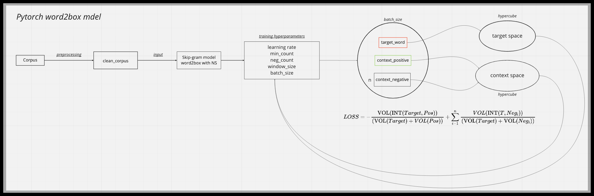

# Word2Box in PyTorch

Implementation of word2box model using the box-embeddings library proposed by Umass IESL - [Box Embeddings: An open-source library for representation learning using geometric structures](https://arxiv.org/pdf/2109.04997.pdf). 

## Word2box Overview

The model architecture described in the thesis:

- Continuous Skip-gram Model (Skip-Gram), model that represents each word as a box instead of a vector and predicts context for a word.

Difference with the original word2vec paper by Mikolov - [Distributed Representations of Words and Phrases and their Compositionality](https://proceedings.neurips.cc/paper/2013/file/9aa42b31882ec039965f3c4923ce901b-Paper.pdf):

- Trained on [WikiText-2](https://pytorch.org/text/stable/datasets.html#wikitext-2) and [WikiText103](https://pytorch.org/text/stable/datasets.html#wikitext103).
- Instead of cosine similarity we use the intersection between two boxes.
- Trained using Negative-sampling algorithm, there's also the possibility to activate the subsampling function.
- For Skip-Gram model all negative context words are sampled using a uniform distribution probability like Mikolov word2vec. 
- Adam optimizer was used instead of Adagrad.
- Trained for 10 epochs.
- Regularization applied: for giving a probabilistic interpretation embedding box are restricted to have volume 1.


### Skip-Gram Model in Details
#### High-Level Model

#### Model Architecture


## Project Structure


```
.
├── README.md
├── config.yaml
├── weights
├── corpus
├── word_similarity_dataset
├── requirements.txt
├── app.py
├── train.py
├── notebooks
│   └── toy_box_embeddings.ipynb
├── utils
│   ├── calculate_correlation.py
│   ├── dataloader.py
│   ├── helper.py
│   ├── inputdata.py
│   └── model.py
│   └── trainer.py  
│   └── word2vec_train.py

```
- **config.yaml** - file with training parameters
- **weights/** - folder where expriments artifacts are stored
- **corpus/** - folder where txt corpus after preprocessing are saved
- **word_similarity_dataset/** - folder with all similarity dataset benchmarks
- **app.py** - Dash app for visualize models
- **train.py** - script for training
- **notebooks/toy_box_embeddings.ipynb** - demo of how box embeddings works and are used
- **utils/calculate_correlation.py** - script for calculate Spearman's correlation
- **utils/dataloader.py** - data loader for WikiText-2 and WikiText103 datasets
- **utils/helper.py** - contains some helper functions
- **utils/inputdata.py** - script that manipulates the data loader
- **utils/model.py** - model architecture
- **utils/trainer.py** - class for model training 
- **utils/word2vec_train.py** - script for train a Gensim word2vec model


## Usage


```
python3 -m word2box_venv
source word2box_venv/bin/activate
pip install requirements.txt
python3 train.py --config config.yaml
```

Before running the command, change the training parameters in the config.yaml, most important:

- model_name ("skipgram")
- dataset ("WikiText2", "WikiText103")
- model_dir (directory to store experiment artifacts, should start with "weights/")

Preprocessing on corpus(Wikitext2, Wikitext103):

- split tokens using regex criteria to identify words and numbers
- All punctuation was removed from the corpus
- numbers were deleted
- <unk> was deleted
- all words were lemmatized and made lowercase
- any token with no-Ascii char was removed
- any token occurring less than 100 times was dropped from Wikitext103
- any token occuring less than 50 was dropped from Wikitext2

the hyperparameters are randomly chose:
- random seed
- batch_size:[2048, 4096, 8192,16384, 32768] (Wikitext103)
- batch_size:[16, 32, 64, 128, 256] (Wikitext2)
- learning rate: log_uniform[exp(-1),exp(-10)]
- Window_size: [5, 6, 7, 8, 9, 10]
- negative_samples: [2, 5, 10, 20]
- sub_sampling threshold: [0.001, 0.0001]


